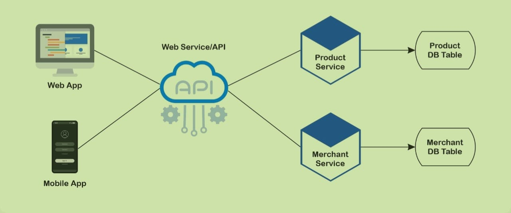

# Project Merchent_ServiceAPI

This repository contains the documentation for [Merchent_Service](https://github.com/nazihadiyana/Project-Merchent_ServiceAPI)'s API

### Contents

- [Description](#1-description)
- [Authentication](#2-authentication)
- [Resources](#3-resources)
  - [Merchants](#31-merchants)
  - [Products](#32-products)
- [Architecture Diagram](#4-architecturediagram)
- [Entity Relationship Diagram](#5-erd)

## 1. Description

Merchat_ServiceAPI is a project in the form Backend API Server Development. This project used for service of a e-commerce to handle the catalog of products owned by merchants. This project uses ExpressJS framework, MySQL as the database, and generated using JSON Web Token (JWT).

## 2. Authentication

A JSON Web Token is a mechanism to verify the merchants (users) of some JSON data's an encoded. In order to open or edit the product, the merchants (users) will need an access token. Access tokens grant limited access to user accounts.

## 3. Resources

In order to publish on behalf of a Medium account, you will need an access token. An access token grants limited access to a user’s account. We offer two ways to acquire an access token: browser-based OAuth authentication, and self-issued access tokens.

We recommend using self-issued access tokens. Browser-based authentication is supported **for existing integrations only**.

The use of the API in this project is divided into 2 groups namely merchant and product. How to access the API is as follows:

### 3.1 Merchants

A merchant could register itself/create an account in the merchant service.

example request and response in Register Merchant:

<details>
<summary><b>Register merchant</b></summary>
<p>

`POST` `/merchant`

_Parameters:_ body

- `name` string, min:3, max:50 \*required
- `password` string, min:6 \*required
- `address` string \*required
- `join_date` date \*required
- `phone_number` string \*required (only Indonesian mobile phone format)

- `status: 200` registration successful

```json
{
  "message": "Merchant has been registered."
}
```

- `status: 400` registration failed

```json
{
  "message": "Phone number is already registered."
}
```

- `status: 400` parameters validation failed

```json
{
  "message": {
    "param_key": ["error message array"]
  }
}
```

</p>
</details>

Where a full Merchant object is:

| Field        | Type   | Description                                        |
| ------------ | ------ | -------------------------------------------------- |
| id           | string | A unique identifier for the merchant.              |
| name         | string | The merchant’s name (min. 3, max. 50).             |
| password     | string | The merchant’s password (min. 6),hashed by bcrypt. |
| address      | string | The merchant’s address                             |
| join_date    | date   | The merchant’s sign up date                        |
| phone_number | number | The merchant's phone number                        |

Possible errors:

| Error code       | Description                                       |
| ---------------- | ------------------------------------------------- |
| 401 Unauthorized | The `accessToken` is invalid or has been revoked. |

### 3.2 Products

#### Listing, Inserting, Updating, and Deleting the products

The users that are logged in can access the list of the products (using GET method), insert products (using POST method), update products (using PUT method), and delete products (using DELETE method).

<details>
<summary><b>GET /products</b></summary>
<p>

The response is a list of products objects. The response array is wrapped in a data envelope wrapped in a data envelope. This endpoint will return all products when the user is logged in.

Example response:

```json
{
  "message": "Product is found",
  "data": [
    {
      "id": 2,
      "merchant_id": 2,
      "name": "Product-2",
      "quantity": 15,
      "price": 155000,
      "createdAt": "2022-06-08T23:10:59.000Z",
      "updatedAt": "2022-06-08T23:10:59.000Z"
    },
    {
      "id": 3,
      "merchant_id": 2,
      "name": "Product-3",
      "quantity": 5,
      "price": 300000,
      "createdAt": "2022-06-08T23:11:45.000Z",
      "updatedAt": "2022-06-08T23:21:57.000Z"
    },
    {
      "id": 4,
      "merchant_id": 4,
      "name": "Product-4",
      "quantity": 5,
      "price": 500000,
      "createdAt": "2022-06-08T23:31:09.000Z",
      "updatedAt": "2022-06-08T23:31:09.000Z"
    },
    {
      "id": 5,
      "merchant_id": 4,
      "name": "Product-5",
      "quantity": 10,
      "price": 230000,
      "createdAt": "2022-06-08T23:31:37.000Z",
      "updatedAt": "2022-06-08T23:31:37.000Z"
    }
  ]
}
```

</p>
</details>

Where a Product object is:

| Field    | Type   | Description                          |
| -------- | ------ | ------------------------------------ |
| id       | string | A unique identifier for the product. |
| name     | string | The product’s name on E-commerce.    |
| quantity | number | The product's quantity (min. 1).     |
| price    | number | The product's price (min. 10000)     |

Possible errors:

| Error code       | Description                                                                           |
| ---------------- | ------------------------------------------------------------------------------------- |
| 401 Unauthorized | The `accessToken` is invalid, lacks the `listPublications` scope or has been revoked. |

## 4. Architecture Diagram



## 5. ERD


